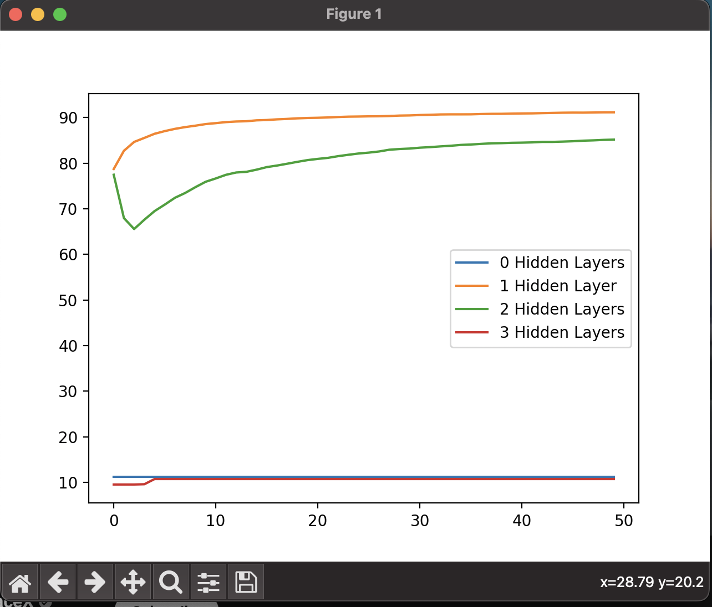

# Neural Nets From Scratch

Written by Ian McKechnie

April 13, 2023

## Purpose
The purpose of this program is to build a neural network from scratch using only numpy. The neural network will be trained on the MNIST data set. The neural network will be trained using backpropagation and stochastic gradient descent. The neural network will be tested on the MNIST test data set. This program compares the learning rates between NNs with 0, 1, 2, and 3 hidden layers.

## How To Run
First download the MNIST data set from [here](https://www.kaggle.com/datasets/oddrationale/mnist-in-csv). Then, unzip the files and place them in the home directory.

You must then delete the first row of each file. This is the header row.

Then run `python3 main.py` in the terminal while in the home directory

## Results

It's clear that one hidden layer is optimal for the MNIST data set.

We can also see that having no hidden and more than 2 hidden layers is the worst options.